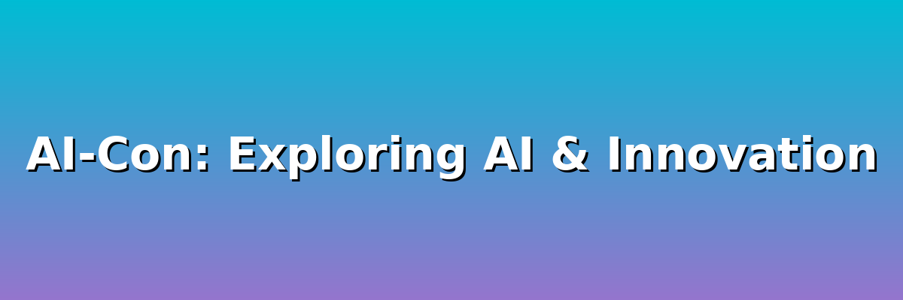

# Welcome to AI-Con

  

## Exploring AI, Responsibility, and Innovation

Welcome to **AI-Con**, your comprehensive resource for understanding artificial intelligence, its implications, and practical applications. This conference explores the transformative power of AI and how we can harness it responsibly.

### What You'll Learn

Dive into the world of AI through our carefully curated chapters:

- **The AI Shift**: Understand how AI is transforming industries and society
- **Responsible AI**: Learn about ethical considerations and best practices
- **Trust**: Explore building and maintaining trust in AI systems
- **Risks**: Identify potential challenges and pitfalls
- **Mitigation**: Discover strategies to address AI-related risks
- **Prompt Engineering**: Master the art of communicating with AI
- **Microsoft Copilot**: Leverage AI in your Microsoft workflow
- **GitHub Copilot**: Enhance your development with AI assistance

### Join the Conversation

AI is reshaping our world, and understanding it is no longer optional—it's essential. Whether you're a developer, business leader, or simply curious about AI, this conference provides the knowledge and tools you need to navigate the AI revolution.

!!! tip "Getting Started"
    Start with [The AI Shift](ai-shift.md) to understand the fundamental changes AI is bringing to our world, or jump to any chapter that interests you most.

### Modern & Accessible Design

This site features:

- 🌓 **Light/Dark Mode Toggle**: Switch between themes for comfortable reading
- 📱 **Responsive Design**: Perfect viewing on any device
- ♿ **Accessibility**: Built with accessibility standards in mind
- 🎨 **Beautiful Gradient Theme**: Elegant cyan to dusty purple design

---

Ready to explore? Use the navigation menu above to begin your journey through the world of AI!
